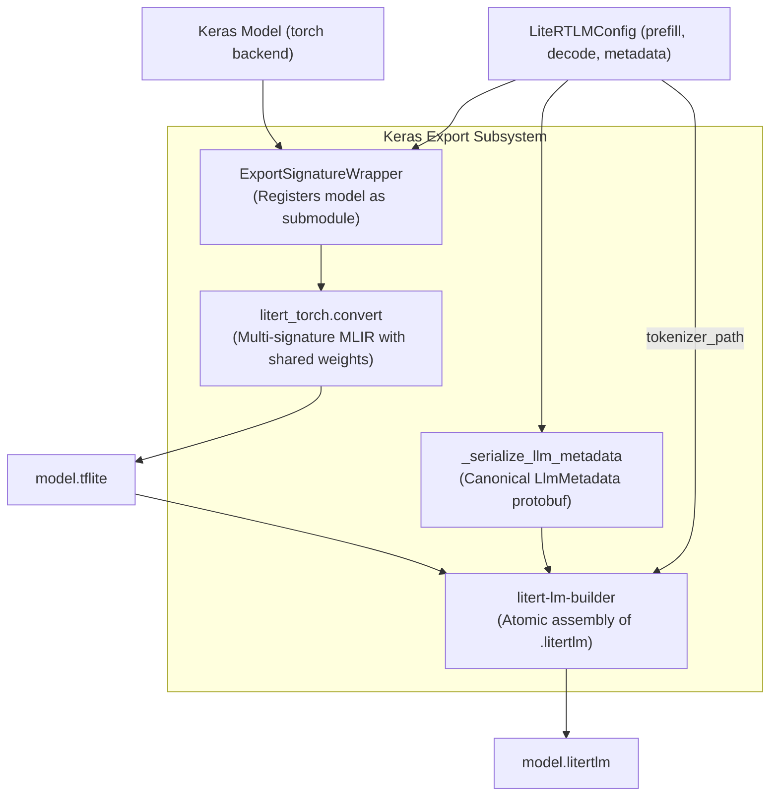

# RFC: Multi-Signature LiteRT and LiteRT-LM Export in Keras Core

**Target:** `keras-team/keras`  
**Authors:** Keras Contributors  
**Status:** Implemented & Verified  

---

## 1. Summary

LiteRT (formerly TensorFlow Lite) is Google's runtime for on-device machine learning, and LiteRT-LM is its specialized C++ and Android execution engine for generative language models.

This RFC proposes two related export capabilities for Keras Core:

1. **Multi-Signature LiteRT Export (`format="litert"`):** Generalize Keras 3's LiteRT export to support multiple entrypoint signatures with shared model weights (e.g. `prefill` + `decode`, encoder + decoder, or embed + classify).
2. **LiteRT-LM Task Bundle Export (`format="litertlm"`):** Provide a standardized pipeline to package generative models into the `.litertlm` task bundle format required by Google's on-device LiteRT-LM runtime (Android `LlmInference` / C++ runtime).

Both capabilities are backend-aligned (PyTorch backend initially via `litert-torch`), strictly domain-agnostic (zero imports of or coupling to `keras-hub`), and introduce **zero mandatory dependencies**.

---

## 2. Motivation & Background

### 2.1 The Problem
Edge LLM runtimes (like LiteRT-LM) do not execute models like standard neural networks. They require:
- **Two distinct signatures:** A prompt-processing signature (**prefill**) that populates the Key-Value (KV) cache, and a single-token autoregressive signature (**decode**) that updates the cache and emits next-token logits.
- **Externalized KV cache:** Persistent per-layer state buffers (`kv_cache_k_{i}`, `kv_cache_v_{i}`) managed by the runtime across execution steps.
- **Static sequence bucketing:** Pre-compiled static shapes (e.g. `prefill_128`, `prefill_256`) to satisfy mobile NPU compilers (Qualcomm Hexagon, MediaTek APU).
- **Single-file bundling:** A packaging format containing the compiled multi-signature model (`model.tflite`), tokenizer assets (`tokenizer.model` or `tokenizer.json`), and generation metadata (`llm_metadata.pb`).

### 2.2 Why Keras Core?
Previously, an effort was made in `keras-hub` (PR #2705). That approach stalled because:
1. It tightly coupled export logic to high-level domain classes (`CausalLM`, `Tokenizer`), creating an unmaintainable surface area.
2. It lacked true multi-signature weight sharing, duplicating model weights 4x–5x in size during export.

Exporting computation graphs to hardware runtimes (TFLite/LiteRT, ONNX, OpenVINO) belongs in the core engine. By placing the engine in `keras-team/keras`:
- **Any** Keras model can be exported (custom architectures, research models, HuggingFace backbones imported to Keras, or KerasHub backbones).
- Downstream domain libraries like `keras-hub` require **zero pull requests or code modifications**.

---

## 3. Architecture & Serving Contract



### 3.1 Weight Sharing Across Signatures
When tracing multiple entrypoints (`prefill_128`, `decode`) via `torch.export`, plain Python functions cause PyTorch to lose track of parameter identities. During compilation, weights become separate constants per signature, inflating a 4 GB model to 20 GB.

**Solution:** `ExportSignatureWrapper` wraps each callable as a `torch.nn.Module` and registers the root model as a child submodule (`self.model = model`). `torch.export` tracks parameter tensors back to the same module instance, allowing MLIR constant-folding to share a single weight buffer across all signatures. When quantization (`quant_config`) is enabled, passing it directly to `litert_torch.convert()` ensures quantized scales and packed constant buffers are unified across all signatures.

### 3.2 The LiteRT-LM Signature & Tensor Contract

The exported `.tflite` model must satisfy the following contract:

| Signature Name | Input Tensors | Output Tensors | Notes |
| :--- | :--- | :--- | :--- |
| `prefill_{seq_len}`<br/>*(e.g. `prefill_128`)* | `tokens`: int32 `[1, S]`<br/>`input_pos`: int32 `[S]` or `[1, S]`<br/>`mask` *(optional)*: float32/float16 `[1, 1, S, S_max]`<br/>`kv_cache_k_{i}`: float16/float32 `[1, H, S_max, D]`<br/>`kv_cache_v_{i}`: float16/float32 `[1, H, S_max, D]` | **GPU/CPU:** `kv_cache_k_{i}`, `kv_cache_v_{i}`: `[1, H, S_max, D]`<br/>**NPU:** `kv_slice_k_{i}`, `kv_slice_v_{i}`: `[1, H, S, D]` | Intermediate logits are discarded during prefill to save memory. Qualcomm Hexagon NPU specifically requires `prefill_128`. `tokens` and `input_pos` **must** be `int32`. |
| `decode` | `tokens`: int32 `[1, 1]`<br/>`input_pos`: int32 `[1]` or `[1, 1]`<br/>`kv_cache_k_{i}`: float16/float32 `[1, H, S_max, D]`<br/>`kv_cache_v_{i}`: float16/float32 `[1, H, S_max, D]` | `logits`: float32 `[1, 1, vocab_size]`<br/>**GPU/CPU:** `kv_cache_k_{i}`, `kv_cache_v_{i}`: `[1, H, S_max, D]`<br/>**NPU:** `kv_slice_k_{i}`, `kv_slice_v_{i}`: `[1, H, 1, D]` | Emits next token logits and advances KV cache. |

*Notation:* $S$ = bucket sequence length; $S_{\text{max}}$ = `context_length`; $H$ = `num_kv_heads`; $D$ = `head_dim`; $i \in [0, \text{num\_layers}-1]$.

#### Critical Tensor Layouts: `BNTH` vs. `BTNH`
The canonical LiteRT-LM runtime layout is `BNTH` (`[1, H, S_max, D]`) or transposed `(BNTH, BNHT)`:
- In the C++ runtime's token eviction logic (`DropTokensfromTensorBuffer`), eviction slices along Axis 2 for Key and Axis 3 for Value. Using `BTNH` (`[1, S_max, H, D]`) slices across Head/Dimension axes instead of Sequence, corrupting weights.
- On Qualcomm Hexagon NPUs, `BTNH` triggers out-of-range memory indexing because the runtime expects `min(last_two_dims)` to be `head_dim`.
- Keras defaults to `BNTH` to guarantee out-of-the-box mobile runtime compatibility.

### 3.3 Attention Masking & Padding Protection in Bucketing
When a prompt of length 40 is mapped to a static bucket of 128 tokens, the trailing 88 tokens contain padding (token ID 0). Without an attention mask, attention mechanisms compute representations for padding tokens and overwrite positions 40–127 in the KV cache with garbage states.

To prevent cache contamination, `LiteRTLMConfig` supports an optional `mask` tensor (`[1, 1, S, S_max]`) populated with $-10000.0\text{f}$ (or $-45824.0\text{f}$ in FP16) over padded positions, ensuring attention weights for padding tokens are exactly zeroed out during cache updates.

### 3.4 KV Cache Adaptation (`GenericKVAdapter`)
Models implement KV caching in one of two ways:
1. **Flat per-layer tensors (native):** The model natively accepts and returns flat `kv_cache_k_{i}` and `kv_cache_v_{i}` tensors. Zero copies.
2. **Stacked tensor (Transformer convention):** The model exposes a cached forward method—such as `call_with_cache(tokens, cache, cache_update_index)`, which steps the model forward while reading and writing a single unified cache tensor `[batch, num_layers, 2, ...]`.

`GenericKVAdapter` bridges stacked models to LiteRT-LM:
- Unpacks flat `BNTH` input tensors into the model's expected cache structure.
- Extracts `cache_update_index = input_pos.flatten()[0]` as a scalar index.
- Invokes `model.call_with_cache(tokens, cache, cache_update_index)`.
- Re-slices updated caches into contiguous flat output tensors.

### 3.5 Runtime Metadata (`llm_metadata.proto`)
The `.litertlm` container includes `llm_metadata.pb`. It serializes:
- `start_token` and `stop_tokens` (supporting both individual token IDs and multi-token stop sequences).
- `max_num_tokens` (`config.context_length`).
- `llm_model_type` (`generic_model`, `gemma`, `llama`, etc., validated against descriptor).
- Optional `jinja_prompt_template`.

*(Note: Layer counts and head dimensions are deliberately omitted from the protobuf; the LiteRT-LM C++ runtime extracts them directly from compiled TFLite tensor dimensions.)*

### 3.6 Multi-Backend Architecture & Roadmap

1. **PyTorch Backend (Implemented):** Uses `litert-torch` via `torch.export` with `ExportSignatureWrapper` module submodule registration.
2. **TensorFlow Backend (Planned):** TensorFlow naturally supports multi-signature TFLite models via `tf.lite.TFLiteConverter.from_concrete_functions()`. Because `tf.Variable` objects retain global identity across concrete functions, weight sharing across signatures is achieved natively without wrapper hacks.
3. **JAX Backend (Planned):** Lowers multi-entrypoint StableHLO modules via `jax.export` directly into the LiteRT compiler pipeline (`litert-jax`).

---

## 4. Public API

### 4.1 `keras.export.LiteRTLMConfig`
A declarative configuration dataclass (with `LiteRTLMSpec` preserved as a backwards-compatible alias):

```python
@keras_export(["keras.export.LiteRTLMConfig", "keras.export.LiteRTLMSpec"])
@dataclass
class LiteRTLMConfig:
    prefill_fn: Callable[..., Any]
    decode_fn: Callable[..., Any]
    context_length: int
    num_layers: int
    num_kv_heads: int
    head_dim: int
    prefill_sample_inputs: Optional[Union[Dict[str, Any], List[Dict[str, Any]]]] = None
    decode_sample_inputs: Optional[Dict[str, Any]] = None
    tokenizer_path: Optional[Union[str, pathlib.Path]] = None
    stop_token_ids: Optional[Union[List[int], List[List[int]]]] = None
    start_token_id: Optional[int] = None
    model_type: str = "generic_model"
    backend_constraint: Optional[str] = None
    quant_config: Optional[Any] = None
    extra_signatures: Optional[Dict[str, Any]] = None
    jinja_prompt_template: Optional[str] = None
    kv_cache_layout: str = "BNTH"
    
    @classmethod
    def create_sample_inputs(
        cls,
        context_length: int,
        num_layers: int,
        num_kv_heads: int,
        head_dim: int,
        prefill_buckets: List[int] = [128],
        kv_cache_layout: str = "BNTH",
        dtype: str = "float16",
    ) -> Tuple[List[Dict[str, Any]], Dict[str, Any]]:
        """Convenience factory generating sample inputs with correct dtypes."""
```

If `prefill_sample_inputs` or `decode_sample_inputs` are omitted, `LiteRTLMConfig` auto-generates them using `create_sample_inputs()`.

### 4.2 Unified Export API
Following Keras 3 API standards, export is invoked through `model.export()`:

```python
# 1. Export generative model to .litertlm bundle
model.export("model.litertlm", format="litertlm", config=config)

# 2. General-purpose multi-signature LiteRT export (any Keras model)
model.export("model.tflite", format="litert", signatures={
    "prefill_128": (prefill_fn, prefill_sample_inputs),
    "decode": (decode_fn, decode_sample_inputs),
})
```

---

## 5. Usage Examples

### 5.1 Exporting a Custom Model (Pure Keras Core)
```python
import keras
from keras.export import LiteRTLMConfig

model = MyCustomGenerativeModel()

# Generate spec with auto-generated sample inputs
config = LiteRTLMConfig(
    prefill_fn=model.prefill,
    decode_fn=model.decode,
    context_length=1024,
    num_layers=12,
    num_kv_heads=8,
    head_dim=64,
    tokenizer_path="tokenizer.model",
    stop_token_ids=[1, 2],
)

model.export("custom_model.litertlm", format="litertlm", config=config)
```

### 5.2 Exporting a KerasHub Model (Zero KerasHub PRs Required)
```python
import keras
from keras.export import LiteRTLMConfig
from keras.src.export.litertlm import GenericKVAdapter
import keras_hub

# 1. Load model
gemma = keras_hub.models.GemmaCausalLM.from_preset("gemma2_2b_en")
backbone = gemma.backbone

# 2. Adapt backbone
adapter = GenericKVAdapter(
    backbone,
    num_layers=backbone.num_layers,
    cache_length=1024,
    kv_cache_layout="BNTH",
)

# 3. Create config with sample inputs (strictly int32 for tokens & pos)
config = LiteRTLMConfig(
    prefill_fn=adapter.prefill,
    decode_fn=adapter.decode,
    context_length=1024,
    num_layers=backbone.num_layers,
    num_kv_heads=backbone.num_key_value_heads,
    head_dim=backbone.head_dim,
    tokenizer_path=gemma.preprocessor.tokenizer.proto,
    stop_token_ids=[gemma.preprocessor.tokenizer.end_token_id],
)

backbone.export("gemma2.litertlm", format="litertlm", config=config)
```

---

## 6. Implementation Details & Systems Robustness

1. **Cross-Device Staging (`EXDEV` Defense):** Staging files are allocated inside `tempfile.TemporaryDirectory(dir=os.path.dirname(os.path.abspath(filepath)))`. This guarantees the temporary staging file resides on the same mount and filesystem as the destination, preventing `OSError: [Errno 18] Invalid cross-device link` on atomic `os.replace`.
2. **Host Memory Mitigation on 7B/8B Models:** Tracing triggers `gc.collect()` and `torch.cuda.empty_cache()` between signature graph traces to release intermediate FX graph tape buffers.
3. **Model State Preservation:** Tracing captures `was_training = model.training` and wraps `model.eval()` in a `try...finally` block to guarantee restoration of original training mode upon completion.
4. **Tokenizer Asset Validation:** Verifies file existence and non-zero size, rejecting empty files and validating SentencePiece/HuggingFace JSON schemas prior to compilation.
5. **Strict Dtype Enforcement:** Validates that `tokens` and `input_pos` are `int32`, raising descriptive errors or casting automatically before tracing.
6. **Descriptor Validation:** Validates `model_type` against `LlmMetadata` protobuf descriptor fields, issuing a warning if falling back to `generic_model`.

---

## 7. Comparison: `keras-hub#2705` vs. Keras Core

| Dimension | Old KerasHub Attempt (`#2705`) | Keras Core Implementation |
| :--- | :--- | :--- |
| **Upstream Dependency** | Blocked on KerasHub maintainers | Independent; lives in Keras Core |
| **Scope** | Only official KerasHub models | Any Keras model or backbone |
| **Weight Deduplication** | Broken (4x–5x file size bloat) | Fixed via submodule registration |
| **KV Cache Layout** | Hardcoded `BTNH` (broken eviction) | Aligned `BNTH` (C++ runtime compliant) |
| **NPU Support** | Failed on Qualcomm NPU (`prefill`) | Works out of the box (`prefill_{seq_len}`) |
| **Filesystem Safety** | Used `/tmp` (vulnerable to `EXDEV`) | Safe staging in destination directory |
| **Protobuf Compliance** | Stored invalid fields in `LlmMetadata` | 100% aligned with canonical schema |
| **Code Changes to `keras-hub`**| Extensive modifications | **0 PRs, 0 lines changed** |

---

## 8. Verification & Test Plan

The implementation is verified with unit tests in `keras/src/export/litertlm_test.py`:
- `test_litertlm_config_validation`: Bounds checks on `context_length`, `num_layers`, `kv_cache_layout`.
- `test_sample_input_generation`: Verifies automatic generation of `int32` token/pos and `float16` `BNTH` KV tensors.
- `test_symlink_rejection`: Validates security rejection of symlinked destination files.
- `test_generic_kv_adapter_shapes_and_returns`: Validates 2-tuple vs 3-tuple model returns and Rank 1 vs Rank 2 `input_pos`.
- `test_build_signatures_map_bucketing`: Confirms `prefill_{seq_len}` signature naming.
- `test_model_export_dispatch`: Verifies `model.export("...", format="litertlm")` dispatch.
- **Code standards:** 100% compliant with 80-character line limit and `ruff` linting. All unit tests pass.
